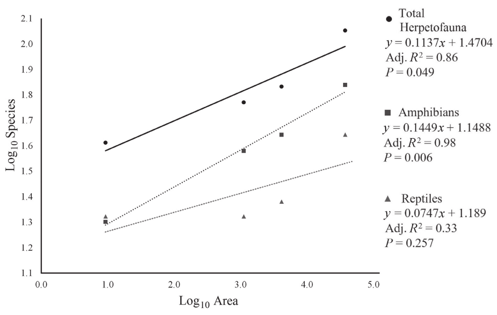

# Herpetofauna of Steele Creek Park (Sullivan County, TN), with Comments on Species–Area Relationships of Amphibians and Reptiles in Eastern Tennessee

**Lance D. Jessee1,\*, Jeremy B. Stout1, and John N. McMeen2**

*Southeastern Naturalist* 21(1):63–73. 2022.

1The Nature Center at Steele Creek Park, Bristol, TN 37620. 2Department of Computer and Information Sciences, Northeast State Community College, Blountville, TN 37617. \*Corresponding author - ljessee@bristoltn.org.

Manuscript Editor: Foster Levy

---

## Abstract

Steele Creek Park, a large municipal park in Sullivan County in northeastern Tennessee, has had nearly continuous observations of natural history data from trained naturalists for more than half a century. Here, we present a herpetofaunal list of species for the park that comprises: 10 species of frogs, 11 species of salamanders, 2 species of lizards, 11 species of snakes, and 7 species of turtles. The inventory includes 10 species previously unreported in Sullivan County. We then compared the park data with increasingly larger land areas in eastern Tennessee to establish a regional species–area curve for herpetofaunal richness that could have predictive capabilities for similar sites in the southern Appalachians.

## Introduction

Steele Creek Park is a 9.259-km² municipal park located in Sullivan County in northeastern Tennessee, near the Virginia border and within the Ridge and Valley physiographic province of the southern Appalachians (Fig. 1). The majority of the park (~8 km²) is undeveloped and within the Beaver Creek Knobs in north-central Sullivan County (USGS 2019). The area in and around Slagle Creek, called Slagle Hollow, is a registered Tennessee State Natural Area. The remaining manicured, low-lying areas contain picnic shelters, a miniature train, disc-golf course, 9-hole golf course, and nature center. The park is also divided by a 0.235-km² lake, impounded in 1964 for recreational use. Timber harvesting at the beginning of the 20th century was the only substantive development within the knobs due to their steep terrain. Although originally planned as a Tennessee State Park in the late 1930s and early 1940s, the land officially became a municipal park in 1964 after the land was deeded to the City of Bristol, TN (Stout 2014). Geographically, nearly all of the park and Beaver Creek Knobs are surrounded by developed areas, creating an island of steep, forested, shale knobs (Levy 2021). This "island in the city" is a prime spot for biogeographical research.

**Figure 1.** Geographic location of Steele Creek Park in northeastern Tennessee (upper left) and Google Maps terrain map of Bristol, Tennessee with Steele Creek Park boundary outlined in black (middle). Photograph of lake and adjacent knobs (bottom right) © J.B. Stout.

Steele Creek Park is unique because it is one of the only places in the surrounding region that has nearly continuously collected species-occurrence data over multiple decades from trained naturalist staff. We were unable to find sufficient multi-year species data for all of the parks or natural areas in the surrounding region and found that many localities have not reliably recorded or retained those data. Since the early 1970s, the park has had trained naturalist staff (with a hiatus in the 1980s and early 1990s), with part of their duties to collect and record species and other natural history data. Early park naturalists primarily focused on natural history inventories (Jackson 1971; Rowell 1971, 1972). Over the last 3 decades, and coinciding with the opening of the nature center, naturalists have become involved in more educational programs in the park while also recording species-occurrence data. We recognize that educational programs play an important role in species data collection. For example, the first confirmed *Pseudotriton montanus diastictus* (Midland Mud Salamander) in the park was found during a program with a school group. Additionally, the first *Carphophis amoenus* (Common Wormsnake) was found by a participant in one of the youth day camps in 2019.

### Herpetofaunal biogeography

The species–area relationship has been referred to as the "closest thing there is to a law in ecology" (Rosenzweig 1995) and states that as habitat area increases so too does species richness, and the increase occurs at a predictable rate (Cain 1938). Some taxa and biota follow the rule more closely than others, and amphibians and reptiles are often used in analyses of the species–area relationship (e.g., Gao and Perry 2016, Ricklefs and Lovette 1999, Tuberville et al. 2005), ostensibly due to their high diversity combined with demanding environmental requirements for homeostasis and reproduction (Araújo et al. 2008).

The goals of this study were to compile a herpetofaunal species list for Steele Creek Park, establish the species–area relationship of amphibians and reptiles in the park's large natural preserve, and then place that relationship in a larger framework of regional biodiversity, in an effort to formulate a predictive equation for amphibian and reptile species richness in the Ridge and Valley Province of the southern Appalachians. Our approach differs from similar works (e.g., Tuberville et al. 2005) not only in geographic scope, but also in the utilization of solely pre-existing data for biogeographical analyses.

## Materials and Methods

### Data collection and vetting

We compiled the herpetofaunal list of Steele Creek Park from nearly 50 years of data recorded by park naturalists beginning with the first biodiversity survey of Rowell (1971). This list includes data from published reports, city government documents, and observational data from park naturalists with verifiable photographs. For the species–area relationship, we used pre-existing species data from vetted sources representing a nested sample (i.e., increasingly larger land areas) to compare with the Steele Creek Park data (Table 1). These areas included Sullivan County, the 5-county area of northeastern Tennessee (Carter, Johnson, Sullivan, Unicoi, and Washington counties), and all of eastern Tennessee (from Bledsoe, Cumberland, Fentress, Marion, Scott, and Sequatchie counties eastward). The eastern Tennessee area is largely based on the area defined by Johnson (1958) from the western portion of the Cumberland Plateau eastward. We gathered species numbers for northeastern Tennessee and eastern Tennessee from data in Niemiller and Reynolds (2011) and Niemiller et al. (2013) where there were definitive county records for each species, Redmond and Scott (1996), and Scott and Redmond (2008). We obtained species numbers for Sullivan County from those same 4 sources, but also included 9 new Sullivan County records from Steele Creek Park with photo vouchers at the David H. Snyder Museum of Zoology, Austin Peay State University (APSU), and 1 species, *Lithobates sphenocephalus* (Southern Leopard Frog), from Jackson (1971) and a 2010 park report. We included only species-level taxonomic assignments in the biogeographical analyses. We follow the taxonomy in Crother (2017).

### Species–area relationships

We calculated the species–area curve as the relationship between species richness and land area. The curve was flattened by taking the log₁₀ values for both species and land area and plotted as a linear regression (to control for small-scale discrepancies such as habitat type diversity or incomplete data). We calculated adjusted R² and P-values for each regression to quantify variance from the line, and thus offer a measure of accuracy for the predictive models.

**Table 1.** Land area and species numbers used in the species–area relationship analysis grouped by total herpetofauna, amphibians, and reptiles in Steele Creek Park, Sullivan County, northeastern Tennessee, and eastern Tennessee.

|  | Area (km²) | Total species | Log₁₀ area | Log₁₀ species |
|---|---|---|---|---|
| **Total Herpetofauna** | | | | |
| Steele Creek Park | 9.3 | 41 | 0.967 | 1.613 |
| Sullivan County | 1114 | 59 | 3.047 | 1.771 |
| Northeastern Tennessee | 4137 | 68 | 3.617 | 1.833 |
| Eastern Tennessee | 37,438 | 113 | 4.573 | 2.053 |
| **Amphibians** | | | | |
| Steele Creek Park | 9.3 | 20 | 0.967 | 1.301 |
| Sullivan County | 1114 | 38 | 3.047 | 1.580 |
| Northeastern Tennessee | 4137 | 44 | 3.617 | 1.643 |
| Eastern Tennessee | 37,438 | 69 | 4.573 | 1.839 |
| **Reptiles** | | | | |
| Steele Creek Park | 9.3 | 21 | 0.967 | 1.322 |
| Sullivan County | 1114 | 21 | 3.047 | 1.322 |
| Northeastern Tennessee | 4137 | 24 | 3.617 | 1.380 |
| Eastern Tennessee | 37,438 | 44 | 4.573 | 1.643 |

## Results

### Steele Creek Park herpetofauna

A total of 41 amphibian and reptile species have been documented in Steele Creek Park comprised of 10 species of frogs, 11 species of salamanders, 2 species of lizards, 11 species of snakes, and 7 species of turtles (Table 2). Three species are represented by more than 1 subspecies: Common Wormsnake is represented by 2 subspecies in the park, *C. a. amoenus* (Eastern Wormsnake) and *C. a. helenae* (Midwestern Wormsnake); *Chrysemys picta* (Painted Turtle) is represented by 2 subspecies, *C. p. picta* (Eastern Painted Turtle) and *C. p. marginata* (Midland Painted Turtle); *Trachemys scripta* (Pond Slider) is represented by 3 subspecies, *T. s. elegans* (Red-eared Slider), *T. s. scripta* (Yellow-bellied Slider), and *T. s. troostii* (Cumberland Slider). Only the latter subspecies is native to the region, and published data is lacking for the species in northeastern Tennessee (Niemiller et al. 2013, Scott and Redmond 2008).

**Table 2.** List of amphibians and reptiles recorded within Steele Creek Park in Sullivan County, TN. Names follow Crother (2017). Superscripted numbers correspond to the APSU voucher number for new county record species as follows: ¹APSU 20118, ²APSU 20114, ³APSU 20113, ⁴APSU 20116, ⁵APSU 20122, ⁶APSU 20120, ⁷APSU 20119, ⁸APSU 20115, ⁹APSU 20121.

| Scientific name | Common name |
|---|---|
| **Frogs** | |
| *Anaxyrus americanus americanus* (Holbrook) | Eastern American Toad |
| *Anaxyrus fowleri* (Hinckley) | Fowler's Toad |
| *Hyla chrysoscelis* Cope | Cope's Gray Treefrog |
| *Lithobates catesbeianus* (Shaw) | American Bullfrog |
| *Lithobates clamitans* (Latreille) | Green Frog |
| *Lithobates palustris* (LeConte) | Pickerel Frog |
| *Lithobates sphenocephalus* (Cope) | Southern Leopard Frog |
| *Lithobates sylvaticus* (LeConte) | Wood Frog |
| *Pseudacris crucifer* (Wied-Neuwied) | Spring Peeper |
| *Pseudacris feriarum* (Baird) | Upland Chorus Frog |
| **Salamanders** | |
| *Ambystoma maculatum* (Shaw) | Spotted Salamander |
| *Cryptobranchus alleganiensis* (Daudin)¹ | Hellbender¹ |
| *Desmognathus fuscus* (Rafinesque) | Northern Dusky Salamander |
| *Desmognathus ochrophaeus* Cope | Allegheny Mountain Dusky Salamander |
| *Eurycea cirrigera* (Green) | Southern Two-lined Salamander |
| *Eurycea lucifuga* Rafinesque | Cave Salamander |
| *Gyrinophilus porphyriticus porphyriticus* (Green) | Northern Spring Salamander |
| *Notophthalmus viridescens viridescens* (Rafinesque) | Red-spotted Newt |
| *Plethodon glutinosus* (Green) | Northern Slimy Salamander |
| *Plethodon richmondi* Netting and Mittleman | Southern Ravine Salamander |
| *Pseudotriton montanus diastictus* Bishop | Midland Mud Salamander |
| **Lizards** | |
| *Plestiodon fasciatus* (L.)² | Common Five-lined Skink² |
| *Sceloporus undulatus* (Bosc and Daudin) | Eastern Fence Lizard |
| **Snakes** | |
| *Agkistrodon contortrix* (L.) | Eastern Copperhead |
| *Carphophis amoenus* (Say) | Common Wormsnake |
| &emsp;*C. a. amoenus* (Say) | &emsp;Eastern Wormsnake |
| &emsp;*C. a. helenae* (Kennicott) | &emsp;Midwestern Wormsnake |
| *Coluber constrictor constrictor* L.³ | Northern Black Racer³ |
| *Diadophis punctatus edwardsii* (Merrem) | Northern Ring-necked Snake |
| *Lampropeltis triangulum* (Lacépède)⁴ | Eastern Milksnake⁴ |
| *Nerodia sipedon sipedon* (L.) | Northern Watersnake |
| *Opheodrys aestivus aestivus* (L.)⁵ | Northern Rough Greensnake⁵ |
| *Pantherophis spiloides* (Duméril, Bibron, and Duméril) | Gray Ratsnake |
| *Regina septemvittata* (Say) | Queensnake |
| *Thamnophis sirtalis sirtalis* (L.) | Eastern Gartersnake |
| *Virginia valeriae valeriae* Baird and Girard | Eastern Smooth Earthsnake |
| **Turtles** | |
| *Apalone spinifera spinifera* (LeSueur) | Eastern Spiny Softshell |
| *Chelydra serpentina* (L.) | Snapping Turtle |
| *Chrysemys picta* (Schneider)⁶ | Painted Turtle⁶ |
| &emsp;*C. p. picta* (Schneider) | &emsp;Eastern Painted Turtle |
| &emsp;*C. p. marginata* Agassiz | &emsp;Midland Painted Turtle |
| *Graptemys geographica* (LeSueur)⁷ | Northern Map Turtle⁷ |
| *Sternotherus odoratus* (Latreille)⁸ | Eastern Musk Turtle⁸ |
| *Terrapene carolina carolina* (L.) | Woodland Box Turtle |
| *Trachemys scripta* (Schoepff)⁹ | Pond Slider⁹ |
| &emsp;*T. s. elegans* (Wied-Neuwied) | &emsp;Red-eared Slider |
| &emsp;*T. s. scripta* (Schoepff) | &emsp;Yellow-bellied Slider |
| &emsp;*T. s. troostii* (Holbrook) | &emsp;Cumberland Slider |

### Species–area relationships

The species–area curve for both total herpetofauna, and amphibians, follows the power-model shape (convex upward without asymptote), whereas the reptile curve is more sigmoid in shape, both of which are consistent with other nested sample data sets (Tjørve and Tjørve 2021). The relationship of species richness to land area was positively correlated and accounted for a large portion of the variation from the line for total herpetofauna (adjusted R² = 0.86) and amphibians (adjusted R² = 0.98). In reptiles, considerably less variation from the line was explainable by the model (adjusted R² = 0.33; Fig. 2). The difference in the taxon models implies that for the region studied, total herpetofaunal richness and amphibian richness adhere more closely to the species–area relationship than do reptiles.

**Figure 2.** Species–area relationship of regional herpetofaunal richness. Log₁₀ of species numbers and land area from data shown in Table 1, with regression equation, adjusted R² and P-values for each line shown. The data are a nested sample comprised of (from smallest to largest area): Steele Creek Park, Sullivan County, the 5-county area of northeastern Tennessee, and eastern Tennessee.

## Discussion

Nearly all of our observations in the park were incidental, and few systematic surveys have been performed in the past. Due to the incidental nature of these observations, inferences on species abundance have not been attempted. A few records deserve further comment. *Anaxyrus fowleri* (Fowler's Toad) has not been observed in the park since 1971 (Jackson 1971). It was the early park naturalists, J.W. Jackson and B. Rowell, who were the first and last naturalists to be in the park overnight for days at a time, which offered them a better chance to observe Fowler's Toads. We believe Fowler's Toads are likely still in the park, but have gone undetected owing to low sampling of nocturnal species. *Virginia valeriae valeriae* (Eastern Smooth Earthsnake) and *Gyrinophilus porphyriticus porphyriticus* (Northern Spring Salamander) have each only been confirmed once in the park. However, these observations were recent, 2017 (Jessee 2017) and 2021, respectively, and it is likely more individuals will be recorded in the future. *Cryptobranchus alleganiensis* (Hellbender) and Midland Mud Salamander have each been observed only twice in the park, most recently in 2012 and 2019, respectively. The Hellbender, a species listed as "vulnerable" and "deemed in need of management" in Tennessee (Niemiller and Reynolds 2011, Withers 2016), is a unique record for the park. The origin of these individuals in the park is unknown. They have either been washed down from an upstream source, introduced, or have possibly originated in the park. Additionally, Southern Leopard Frog has only been observed once since the early 1970s, in 2010. Systematic surveys over multiple years would yield a better understanding of the population abundances and distribution patterns of the park's herpetofauna. Although records are scarce, they are reliable and therefore were included in the analyses.

### Questionable and/or erroneous park records

There have been a few anecdotal and questionable observations from Steele Creek Park that we were unable to confirm, either because no substantiation exists or the species identity could not be agreed upon. These were not included in the park herpetofaunal list (Table 2) or the analyses. *Desmognathus monticola* Dunn (Seal Salamander) was a species once included on a park checklist, but after further examination, no substantiation for a record could be gathered. There is an unconfirmed report of a Seal Salamander from the headwaters of Trinkle Creek and an unconfirmed third-hand report of *Eurycea longicauda* (Green) (Long-tailed Salamander) from the park below the dam (K. Hamed, Department of Fish and Wildlife Conservation, Virginia Polytechnic Institute and State University, Blacksburg, VA, 2022 pers. comm.). There has been 1 observation from a vernal wetland that was presumed to be *Pseudacris brachyphona* (Cope) (Mountain Chorus Frog). Although the frog was photographed, the species identity could not be ascertained. Additionally, we have not yet heard the calls of Mountain Chorus Frogs in the park. *Plestiodon laticeps* (Schneider) (Broad-headed Skink) was another species once included on a park checklist, and there is anecdotal evidence of sightings, but no substantiation (K. Hamed, 2022 pers. comm.). There is an unconfirmed report from the mid-1990s of *Heterodon platirhinos* Latreille (Eastern Hognose Snake), but that observation was never recorded or photographed, so it is also not included in the park list. There have also been multiple reports of *Pseudemys concinna* (LeConte) (River Cooter) over the years, but we have not been able to confirm them or observe the species ourselves. However, the Seal Salamander, Long-tailed Salamander, Mountain Chorus Frog, and Eastern Hognose Snake have been recorded either in Sullivan County or bordering counties (Redmond and Scott 1996, Scott and Redmond 2008), and we think any of these species are likely in the park and could be verified with increased sampling.

A roadkill individual of *Lampropeltis elapsoides* (Holbrook) (Scarlet Kingsnake) was found by a park naturalist (L. McDaniel) in 2010 in a neighborhood bordering the park. We are unsure of the origins of this snake, and it seems unlikely that it originated in the wild; it was likely either an escaped/released captive animal or it may have stowed away on a vehicle from another area. However, the distribution of this species is spotty in Tennessee and still poorly understood (Gibbons 2017, Niemiller et al. 2013, Scott and Redmond 2008). The skeleton and skin are now housed and cataloged in the Steele Creek Park Nature Center collections (SCPNC-Z 065).

### Biogeography of regional herpetofaunal richness

As a cursory approach to quantifying herpetofaunal richness in the southern Appalachians, our analysis provides compelling evidence for predictability of amphibian and reptile richness per land area, at least within temperate regions of similar geography in eastern Tennessee and the surrounding vicinity.

An important application of the species–area relationship is the a priori prediction of species richness if land area is known (Darlington 1957). Thus, the linear equations shown in Figure 2 should have predictive capability for estimating regional herpetofaunal richness.

We tested the species–area model with a cursory examination of pre-existing literature that report herpetofauna in the study area, and areas adjacent to it. As suggested by the results, in practical application, amphibians fit the regression better than reptiles. The better fit of the amphibian data may be a consequence of the higher regional species richness compared to reptiles. Our results are supported by findings in sites with a rich history of sampling and recordkeeping, such as that seen in the Great Smoky Mountains National Park. Per land area (2114 km²), our model predicts 42.7 species of amphibians, which corresponds remarkably well with the 43 species reported by Tilley and Huheey (2001). The regression under-predicted reptiles in the park (27 predicted versus 38 reported), which is consistent with the non-significant relationship shown by the species–area model for reptiles. Cumberland Gap National Park also fit the model (within the standard error) for both reptiles and amphibians. At 82.74 km², our model predicts 26.7 amphibians and 21.4 reptiles, compared with 28 amphibians and 20 reptiles reported by Barbour et al. (1979).

Other sites outside of the study area but still in the Ridge and Valley may fit the regression but are currently under-reported in herpetofaunal richness. The Radford Army Ammunition Plant (southwestern Virginia), a 32.7-km² area, had 19 known amphibians and 14 reptiles (Garriock and Reynolds 2005), whereas our model predicts 23.3 amphibians and 20.1 reptiles from a site of that size. The degree of habitat destruction and/or development in certain sampling areas could also account for under-reported species numbers.

Additionally, some sites may represent a lower floor of the utility of our regression, or be a hyper-diverse habitat relative to its small size, or both. Crockett (2001) reported 12 amphibians from the 0.101-km² Henderson Wetland (Washington County, TN), whereas our regression predicts only 10.1 amphibian species. Reptiles were not reported at that site.

Not tested here are the possible effects of clinal geography on species richness, and workers should exercise caution applying this formula to habitats in the highland areas (> ~900 m elevation) along the eastern rim of the study area. Reptile species richness is not as closely correlated with land area as amphibian richness using the current data, which could be a sampling artifact. Increased sampling of sites within the study area could potentially strengthen the relationship.

The species–area relationship derived here will improve with increased data collection, and we welcome its testing on other similar sites with well-documented natural history records and as new species-occurrence data are collected. This newly estimated relationship utilizing a classic ecological maxim has important implications for land use and conservation efforts and also establishes a temporal regional baseline for herpetofaunal richness. Globally, amphibians and reptiles are 2 taxonomic groups known as ecological bellwethers (Gibbons et al. 2000), and understanding their biogeography at all scales will prove invaluable in an increasingly anthropogenically influenced, changing biosphere.

## Acknowledgments

We thank our current Nature Center colleagues Don Holt, Mike Gartin, and Jean Van Olst for their support and observational park data. We also thank Larry McDaniel for many years of record keeping of the park biota and Cade Campbell for his observational park data. We are grateful to the Friends of Steele Creek Nature Center and Park and the City of Bristol, TN, for their support. We are also grateful for all other past park naturalists and Nature Center employees for their many years of herpetofaunal observations and record keeping. Jessica T. Grady of Austin Peay State University and Dr. Joshua Hall of Tennessee Tech University verified the new county records.

## Literature Cited

Araújo, M.B., D. Nogués-Bravo, J.A.F. Diniz-Filho, A.M. Haywood, P.J. Valdes, and C. Rahbek. 2008. Quaternary climate changes explain diversity among reptiles and amphibians. *Ecography* 31:8–15.

Barbour, R.W., W.H. Davis, and R.A. Kuehne. 1979. The vertebrate fauna of Cumberland Gap National Historical Park. University of Kentucky, Lexington, KY. 82 pp.

Cain, S.A. 1938. The species–area curve. *American Midland Naturalist* 19:573–581.

Crockett, M.E. 2001. Survey and comparison of amphibian assemblages in two physiographic regions of Northeast Tennessee. M.Sc. Thesis. East Tennessee State University, Johnson City, TN. 69 pp.

Crother, B.I. 2017. Scientific and standard English names of amphibians and reptiles of North America north of Mexico, with comments regarding confidence in our understanding, 8th edition. Society for the Study of Amphibians and Reptiles, Herpetological Circular No. 43. 102 pp.

Darlington, P.J., Jr. 1957. Zoogeography: The Geographical Distribution of Animals. John Wiley and Sons, New York, NY. 675 pp.

Gao, D., and G. Perry. 2016. Species–area relationships and additive partitioning of diversity of native and nonnative herpetofauna of the West Indies. *Ecology and Evolution* 6:7742–7762.

Garriock, C.S., and R. Reynolds. 2005. Results of a herpetofaunal survey of the Radford Army Ammunition Plant in southwestern Virginia. *Banisteria* 25:1–22.

Gibbons, W. 2017. Snakes of the Eastern United States. University of Georgia Press, Athens, GA. 416 pp.

Gibbons, J.W., D.E. Scott, T.J. Ryan, K.A Buhlmann, T.D. Tuberville, B.S. Metts, J.L. Greene, T. Mills, Y. Leiden, S. Poppy, and C.T. Winne. 2000. The global decline of reptiles, déjà vu amphibians. *BioScience* 50:653–666.

Jackson, J.W. 1971. A natural history inventory and limnological study of Steele Creek Park, Bristol, Tennessee. Presented to The Park and Recreation Commission, Bristol, TN. 263 pp.

Jessee, L.D. 2017. Geographic distribution: *Virginia valeriae valeriae*. *Herpetological Review* 48:592.

Johnson, R.M. 1958. A biogeographic study of the herpetofauna of eastern Tennessee. Ph.D. Dissertation. University of Florida, Gainesville, FL. 231 pp.

Levy, F. 2021. Vascular flora and biogeographic affinity of the Sevier Shale knobs of northeastern Tennessee. *Castanea* 86:125–142.

Niemiller, M.L., and R.G. Reynolds. 2011. The Amphibians of Tennessee. University of Tennessee Press, Knoxville, TN. 369 pp.

Niemiller, M.L., R.G. Reynolds, and B.T. Miller. 2013. The Reptiles of Tennessee. University of Tennessee Press, Knoxville, TN. 366 pp.

Redmond, W.H., and A.F. Scott. 1996. Atlas of amphibians in Tennessee. The Center of Excellence for Field Biology, Austin Peay State University, Clarksville, TN (updated 18 November 2019). Available at https://www.apsubiology.org/tnamphibiansatlas/. Accessed 12 September 2021.

Ricklefs, R.E., and I.J. Lovette. 1999. The roles of island area per se and habitat diversity in the species–area relationships of four Lesser Antillean faunal groups. *Journal of Animal Ecology* 68:1142–1160.

Rosenzweig, M.L. 1995. Species Diversity in Space and Time. Cambridge University Press, Cambridge, UK. 460 pp.

Rowell, B. 1971. A natural history inventory of Steele Creek Park, Bristol, Tennessee, summer 1970. Presented to the Park and Recreation Commission, Bristol, Tennessee. 302 pp.

Rowell, B. 1972. A natural history inventory: Slagle Hollow Environmental Demonstration Area. Presented to the Park and Recreation Commission, Bristol, Tennessee. 171 pp.

Scott, A.F., and W.H. Redmond. 2008. Atlas of reptiles in Tennessee. The Center of Excellence for Field Biology, Austin Peay State University, Clarksville, TN (updated 18 November 2019). Available at http://www.apsubiology.org/tnreptileatlas/. Accessed 12 September 2021.

Stout, J. 2014. Steele Creek Park remembers its history as it celebrates 50 years. *The Tennessee Conservationist*, May/June:30–32.

Tilley, S.G., and J.E. Huheey. 2001. Reptiles and Amphibians of the Smokies. Great Smoky Mountains Natural History Association, Gatlinburg, TN. 143 pp.

Tjørve, E., and K.M.C. Tjørve. 2021. Mathematical expressions for the species–area relationship and the assumptions behind the models. Pp. 157–184, *In* T.J. Matthews, K.A. Triantis, and R.J. Whittaker (Eds.). The Species–Area Relationship: Theory and Application. Cambridge University Press, Cambridge, UK. 502 pp.

Tuberville, T.D., J.D. Willson, M.E. Dorcas, and J.W. Gibbons. 2005. Herpetofaunal species richness of southeastern national parks. *Southeastern Naturalist* 4:537–569.

United States Geological Survey (USGS). 2019. Bristol Quadrangle, Tennessee–Virginia, 7.5 minute series [map]. 1:24,000 scale. Reston, VA.

Withers, D.I. 2016. A guide to the rare animals of Tennessee. Division of Natural Areas, Tennessee Department of Environment and Conservation, Nashville, TN. 89 pp.
